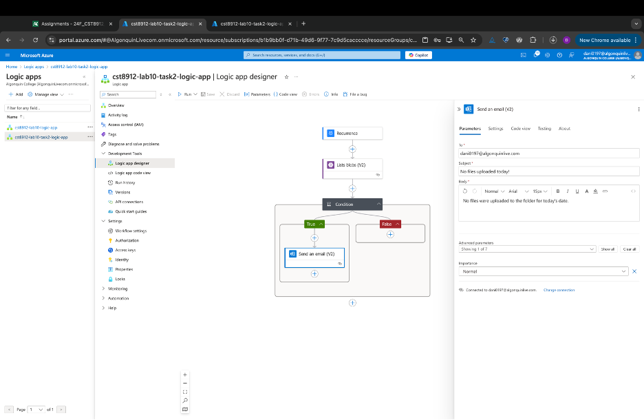

# CST8912 – Cloud Solution Architecture

## Cloud Development and Operations  
**CST8912_013 Cloud Solution Architecture**  
**Lab 10_Week 13**

### Prepared By:  
Daniyal Shahid (041110791)  

### Submitted to:  
Prof. Ragini Madan  

---

## Graded Lab Activity #10

### Problem Statement:
I have a storage account in Azure. In the container, we are storing various data files. The files are stored in a tree hierarchy of folders (Parent -> year -> month -> day). Each day, new files get uploaded to the specific day folder. If the file for that specific day is not uploaded, I would like to drop an email notification.

---

## Task 1:
1. Create a Logic App (choose consumption-based plan) and an SQL database instance in the Canada Central region.  


2. Create an `alerts` table in the SQL database using the query editor.  


3. Insert records into the `alerts` table using the query:

```sql
Insert into [dbo].[Alerts] (ToAddress,MailSubject,MailBody,EmailSent) 
values ('youremail','demoApp1','This is message body1',0)
go

Insert into [dbo].[Alerts] (ToAddress,MailSubject,MailBody,EmailSent) 
values ('youremail','demoApp2','This is message body2',0)
go

Insert into [dbo].[Alerts] (ToAddress,MailSubject,MailBody,EmailSent) 
values ('youremail','demoApp3','This is message body3',0)
go
```


4. Select rows from the `alerts` table to verify the records inserted in the table.


5. Go to the Logic App created in the lab.  
6. Use the Recurrence trigger and define values for interval (3) and frequency (minute).  


7. Add a new step named “SQL Server,” and use “Get Rows” as the action.  
8. Enter the credentials (in the background, connectors are getting created). Enter your server name (FQDN), database name, username, and password.  


9. Add a new step `For-Each` in the Logic App.  
10. Select the `Value` parameter from Dynamic Content.  
11. Add a `Send Mail` action.  
12. Enter the details from Dynamic Content (refer to values from columns defined in the `alerts` table).  
13. Save the Logic App.  
14. Wait for some time, and you will receive an email.  


---

## Task 2:
### Design a logic to trigger an email notification in your Outlook when the file for a specific folder does not get uploaded by a specific time.
1. Create a storage account in the Canada Central region.  


2. Create a sample container, and within that container, create a folder in the format of `yyyy-mm-dd`. 
 


3. Create a trigger to schedule this logic every day at 6 PM.  




4. Use `List Blob` to check every file in the folder. To check the file in the folder, you can use the expression like:  
   ```
   concat('/', utcNow('yyyy/MM/dd'))
   ```  
   If the file in the path does not exist, `List Blob` will fail.  


5. Send an email to your email address in Outlook if `List Blob` fails.  

---

## Task 3:
Monitor workflows in Azure Logic Apps.


---

## Task 4:
Clean all the resources created during this lab and record all the steps with screenshots in the lab report.


