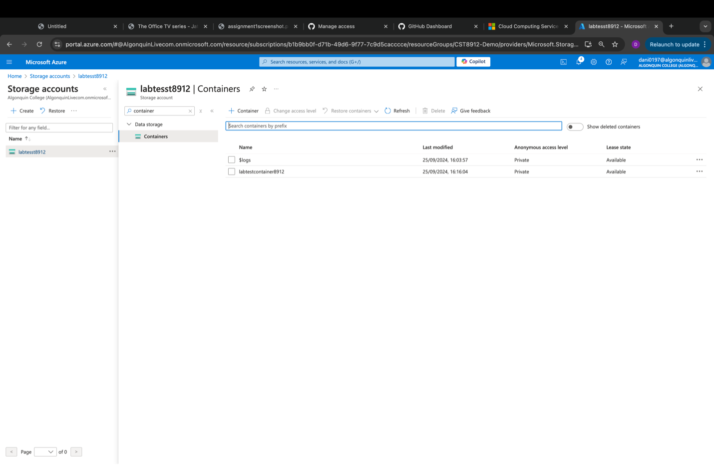

# CST8912 – Cloud Solution Architecture

## Cloud Development and Operations
### CST8912_013 Cloud Solution Architecture  
### Lab 3_Week 4

---

**Prepared By:**  
Daniyal Shahid (041110791)  

**Submitted to:**  
Prof. Ragini Madan  

---

## Graded Lab Activity #3

### Purpose of this hands-on Lab:

In this lab, you will explore the Azure storage account, generate shared access signatures for Azure Cloud, and learn how to change rules and conditions to manage the lifecycle of cloud storage.

---

### Steps:

1. **Create a storage account**  
   Create a storage account named `labtest8912` under the student subscription and resource group `CST8912-demo` in the Canada Central region. Select geo-redundant storage (GRS), keeping the networking and data protection options as default.  
   _Score: /2_

        

2. **Change redundancy and set blob access tier**  
   Go to your storage account resource blade, under the data management section, click the **Redundancy** tab. Change redundancy to "Local Redundant Storage (LRS)" from the dropdown. Under **Settings**, choose **Configuration** and set the blob access tier to "Cool", then save the change.  
   _Score: /2_

        

     

3. **Create a container and upload a blob**  
   Under **Data Storage** on the left, click **Containers**, then add a new container named `labtestcontainer8912`. Upload a blob, change the advanced settings, and set the access tier to "Hot". Upload the blob to a folder named `sampletest8912`, browsing the sample files shared in this lab. (If you cannot find the sample file link, check with your instructor.)  
   _Score: /6_

     

     

4. **Test the blob URL**  
   Click the uploaded file in the container to view the configuration options. Copy the blob URL, open a new private browser window, and paste the copied URL.  
   **Note:** The URL should not work, as the container's public access is set to private (resource not found).  
   _Score: /2_

     

5. **Generate and test SAS token**  
   On the file blade, click **Generate SAS**, copy the SAS token generated, and paste the blob SAS URL in the private browser window. You should be able to see the file.  
   _Score: /3_

   
   
     

6. **Set up Lifecycle Management**  
   On the container blade, under the **Data Management** tab, go to **Lifecycle Management**. Create a new rule named `myrule8912`. Set the rule scope to "Limit blobs with filters". Set the blob type and blob subtype to default. Add a condition: if base blobs were last modified more than "15 days" ago, then move them to "Cool Storage".  
   _Score: /4_

     

     

     

7. **Delete resources and create lab report**  
   After the demo, delete all the resources created during the lab and create a lab report documenting all the steps with screenshots.  
   _Score: /1_

     

---

### Learning Outcomes:

By completing this lab, you have gained practical experience in:

- **Creating and managing Azure storage accounts**: Setting up storage accounts with geo-redundancy and changing redundancy types to match performance and cost needs.
- **Blob access tiers**: Understanding how different access tiers (Hot, Cool) impact data storage cost and performance.
- **Shared Access Signatures (SAS)**: Generating SAS tokens to provide granular, time-limited access to specific resources.
- **Lifecycle management**: Automating data movement between storage tiers based on access patterns, ensuring cost-efficiency over time.

### Real-World Use Case:

The concepts explored in this lab are crucial for organizations managing large-scale data in the cloud. For example, an e-commerce company could store frequently accessed images and product details in the "Hot" tier while moving historical data, like transaction logs older than 30 days, to "Cool" or "Archive" tiers. By using **Azure Lifecycle Management**, such a company would significantly reduce storage costs while maintaining data availability when needed.

### Conclusion:

This lab illustrated how Azure storage accounts can be configured and optimized for different use cases. From setting up proper redundancy to managing blob access tiers and lifecycle policies, you’ve learned how to implement cloud storage solutions that balance performance, availability, and cost. These skills are essential for any cloud solution architect aiming to create scalable, efficient cloud environments.
Key Additions:

