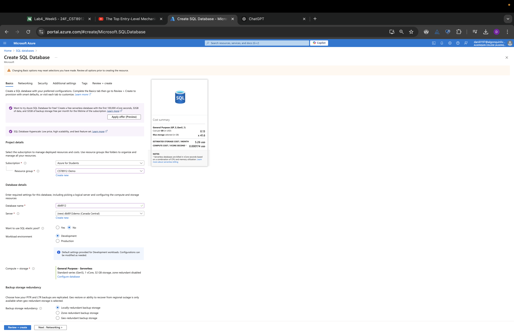

# CST8912 – Cloud Solution Architecture

## Cloud Development and Operations  
**CST8912_013 Cloud Solution Architecture**  
**Lab 4_Week 5**

### Prepared By:  
**Daniyal Shahid (041110791)**  

### Submitted to:  
**Prof. Ragini Madan**  

---

## Graded Lab Activity #4

1. **Configure Azure SQL database** for the Canada central region under your resource group `cst8912-demo`, choose **single database** under SQL databases in the SQL deployment option. **/1**



2. Enter the following values in the **create database page** and keep other properties with their default settings: **/4**  
   - **Subscription**: Select your Azure subscription  
   - **Resource group**: `CST8912-demo`  
   - **Database name**: `db8912`  
   - **Server**: Select **Create new** and create a new server with a unique name in any Canada central location. Use SQL authentication and specify your name as the server admin login and a suitably complex password (remember the password—you'll need it later!)  
   - **Server**: `db8912demo`  
   - **Username**: `db8912_yourname`  
   - **Password**: `dfguyt@234!`  
   - **Want to use SQL elastic pool?**: No  
   - **Workload environment**: Development  
   - **Compute + storage**: Leave unchanged  
   - **Backup storage redundancy**: Locally-redundant backup storage  

3. On the **Create SQL Database** page, select **Next: Networking >**, and on the Networking page, in the **Network connectivity** section, select **Public endpoint**. Then select **Yes** for both options in the **Firewall rules** section to allow access to your database server from Azure services and your current client IP address.

4. Select **Next: Security >** and set the **Enable Microsoft Defender for SQL** option to **Not now**.

5. Select **Next: Additional Settings >**, and on the **Additional settings** tab, set the **Use existing data** option to **Sample** (this will create a sample database that you can explore later).

6. Select **Review + Create**, and then select **Create** to create your Azure SQL database.

7. In the pane on the left side of the page, select **Query editor (preview)**, and then sign in using the administrator login and password you specified for your server.

8. Expand the **Tables** folder to see the tables in the database.

9. In the **query 1** pane, try executing the following queries, and select **run** to execute the query: **/2**

   ```sql
   SELECT ProductID, Name, ListPrice, ProductCategoryID  
   FROM SalesLT.Product;
   ```

   ```sql
   SELECT p.ProductID, p.Name AS ProductName,  
          c.Name AS Category, p.ListPrice  
   FROM SalesLT.Product AS p  
   JOIN [SalesLT].[ProductCategory] AS c  
       ON p.ProductCategoryID = c.ProductCategoryID;
   ```

10. **Create an Azure storage account** with the following settings, keeping the other advanced, networking, data protection, encryption settings default. **/2**

11. **Create a container** “`productdata8912`” in the storage account. **/1**

12. Create a new resource in your resource group from the Azure portal, search for **Azure Data Factory** with the following configuration, keeping Git configuration, networking, advanced settings as default. **/10**

13. Once created, launch **Azure Data Factory Studio**.

14. On the homepage, choose the option to **ingest data**.

15. Choose task type, **built-in copy task**, and task cadence **“run once now”**.

16. In **source type**, choose **Azure SQL Database** from the dropdown, and in the connection, choose **new connection** with the following configuration and test the connection.

17. Select the **source table** as `SalesLT.Product` from the dropdown, click **next** and preview the data.

18. Click **next**, choose **destination type**, select **“Azure Blob Storage”** from the dropdown.

19. Create a **new connection** and test the connection to the storage account, choose the folder path and enter the file name.

20. Choose the configuration.

21. Review and finish this pipeline and check the storage account container to see the product CSV file copied from the database to the storage account.

22. After the demo, delete all the resources created during this lab and create a lab report documenting all the steps performed in the lab along with the screenshots.

---

## Learning Outcomes
- Learn how to configure an Azure SQL Database and manage it within a cloud environment.
- Understand how to query databases using SQL for retrieving product data.
- Gain practical experience with Azure Data Factory for transferring data from an SQL database to Azure Blob Storage.
- Develop skills in setting up and managing cloud-based data pipelines.

## Real-World Use Case
A company managing large amounts of sales data could use Azure SQL Database to store transaction records. Azure Data Factory can then automate the transfer of this data to Azure Blob Storage for backups or further analysis, ensuring secure and efficient data handling.

## Conclusion
This lab demonstrated the complete process of setting up an Azure SQL Database, querying it, and using Azure Data Factory to move data to Blob Storage. It reinforced the practical skills required to manage cloud databases and automate data workflows in a scalable and resilient way.

