# CST8912 – Cloud Solution Architecture

---

## Cloud Development and Operations  
### CST8912_013 Cloud Solution Architecture  
### Lab 6_Week 7

---

**Prepared By:**  
Daniyal Shahid (041110791)  

**Submitted to:**  
Prof. Ragini Madan

---

### Graded Lab Activity #7

1. Analyze the cost-effectiveness of competing architectural solution proposals.
   - Test the use of native tools available through cloud providers to manage costs
   - Determine the guidance framework for managing and optimizing costs of cloud solutions
   - Use strategies to track the cost metrics using cloud price calculators
   - Review vendor offerings, services, pricing models, and service level agreements (SLA)

---

### Introduction:
Cloud provider provides a variety of cloud services in a variety of cloud service models: IaaS, PaaS, and SaaS. When businesses migrate to the cloud, they must choose which model is best suited to their needs and is the most cost-effective. This course is designed to assist Cloud Architects in identifying their current cloud expenditures and providing greater awareness of the costs associated with each deployment model as well as each aspect of a cloud deployment.  
Optimizing cloud costs begins with knowing your current cloud expenditures. This course introduces you to the tools built into the cloud Portal that can help you understand the total overall expenditures in cloud as well as break down those costs by area: Compute, Network, Storage, Identity, and App/Cloud Services.  
The remainder of the course drills down on specific costs associated with each area of cloud identifies the costs associated with each service and provides very clear and concise methods for reducing cloud expenditures. Many of the cost savings methods will require minimal changes to your cloud deployment and will take just minutes to implement while other cost savings methods may take a shift in your cloud strategy, such as moving from Iaas to PaaS.

### Purpose of the hands-on-lab that can be simulated for any CSP: 
In this lab you will explore azure functionality that would provide insight into performance and configuration of Azure resources, focusing in particular on Azure virtual machines. To accomplish this, you intend to examine the capabilities of Azure Monitor, including Log Analytics.

---

### Lab scenario
Your organization has migrated their infrastructure to Azure. It is important that Administrators are notified of any significant infrastructure changes. You plan to examine the capabilities of Azure Monitor, including Log Analytics.

---

### Task 1: Use a template to provision an infrastructure
1. In this task, you will deploy a virtual machine that will be used to test monitoring scenarios.
2. Download the \Allfiles\Lab11\az104-11-vm-template.json lab files to your computer.
3. Sign in to the Azure portal - https://portal.azure.com.
4. From the Azure portal, search for and select Deploy a custom template.
5. On the custom deployment page, select Build you own template in the editor.
6. On the edit template page, select Load file.
7. Locate and select the \Allfiles\Labs11\az104-11-vm-template.json file and select Open.
8. Select Save.
9. Use the following information to complete the custom deployment fields, leaving all other fields with their default values:
   - Setting	Value
   - Subscription	Your Azure subscription
   - Resource group	CST8912 (If necessary, select Create new)
   - Region	Canada Central
   - Username	localadmin
   - Password	Provide a complex password
10. Select Review + Create, then select Create.

 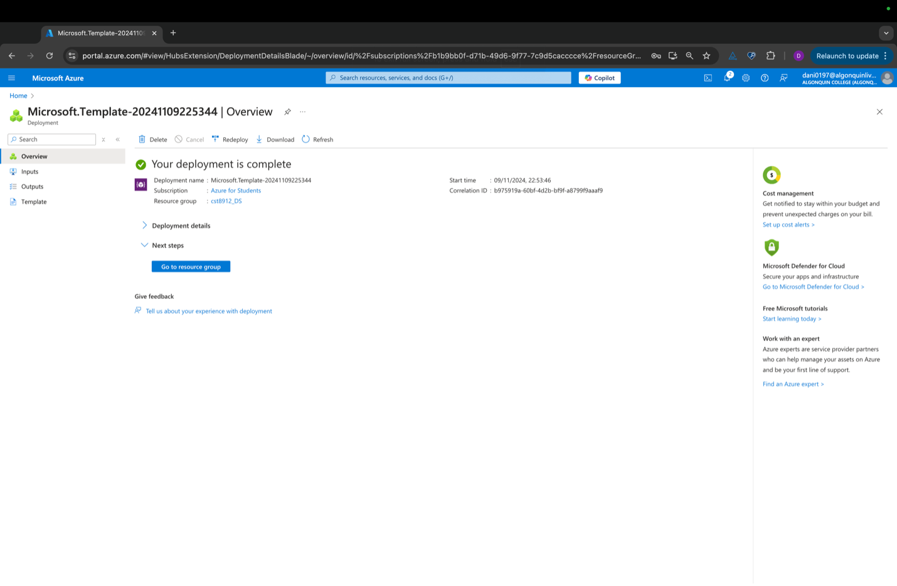

11. Wait for the deployment to finish, then click Go to resource group.
12. Review what resources were deployed. There should be one virtual network with one virtual machine.

 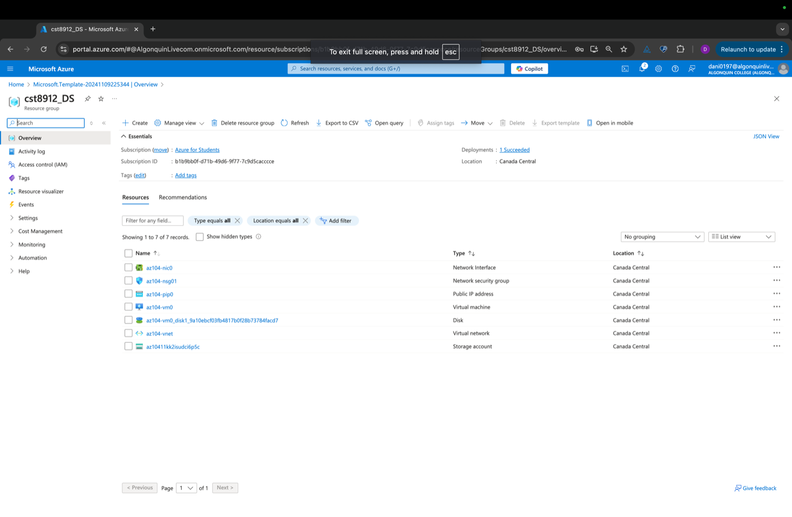

13. Configure Azure Monitor for virtual machines (this will be used in the last task)
14. In the portal, search for and select Monitor.
15. Take a minute to review all the insights, detection, triage, and diagnosis tools that are available.
16. Select View in the VM Insights box, and then select Configure Insights.
17. Select your virtual machine, and then Enable (twice).
18. Take the defaults for subscription and data collection rules, then select Configure.
19. It will take a few minutes for the virtual machine agent to install and configure, proceed to the next step.

 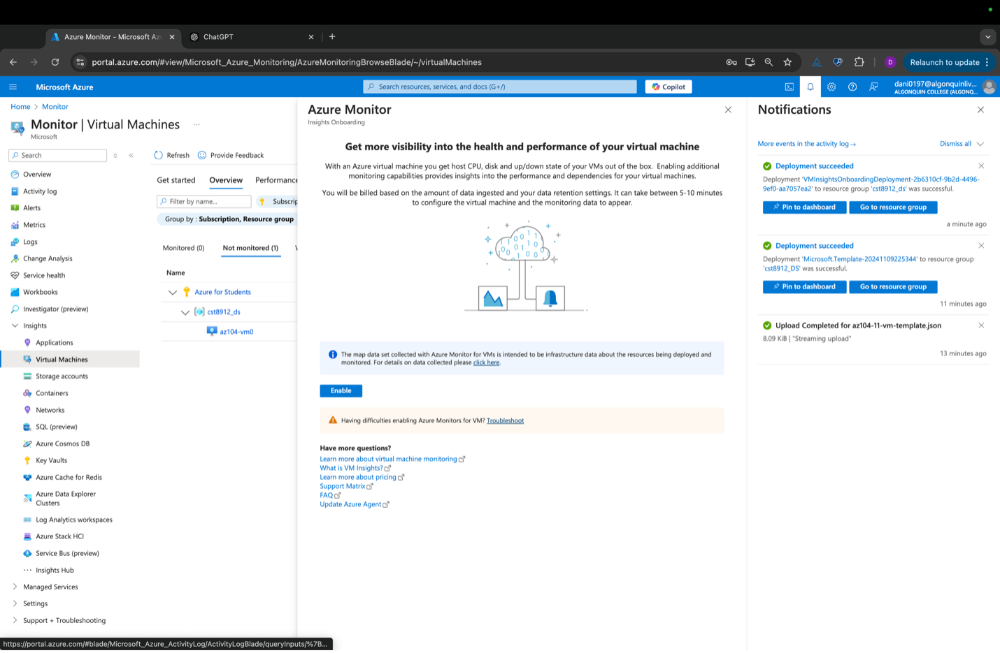


---

### Task 2: Create an alert
1. In this task, you create an alert for when a virtual machine is deleted.
2. Continue on the Monitor page, select Alerts.
3. Select Create + and select Alert rule.
4. Select the box for the resource group, then select Apply. This alert will apply to any virtual machines in the resource group. Alternatively, you could just specify one particular machine.

 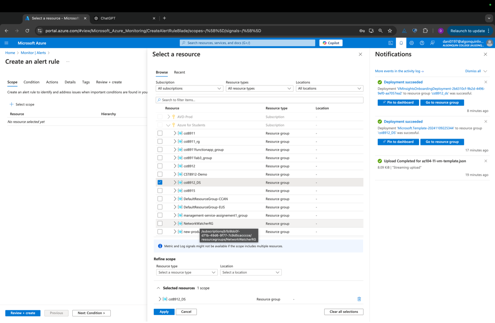

5. Select the Condition tab and then select the See all signals link.
6. Search for and select Delete Virtual Machine (Virtual Machines). Notice the other built-in signals. Select Apply.

 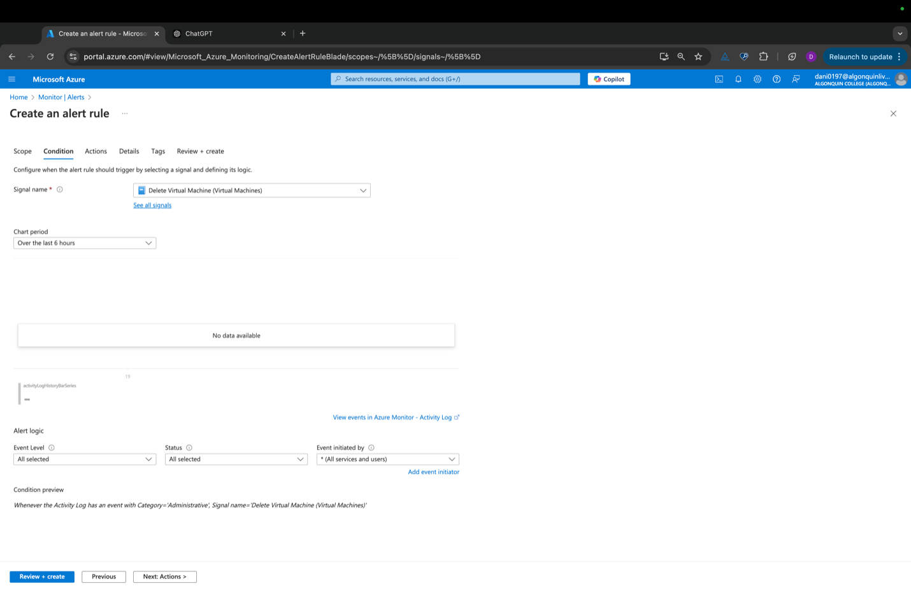

7. In the Alert logic area (scroll down), review the Event level selections. Leave the default of All selected.
8. Review the Status selections. Leave the default of All selected.
9. Leave the Create an alert rule pane open for the next task.

 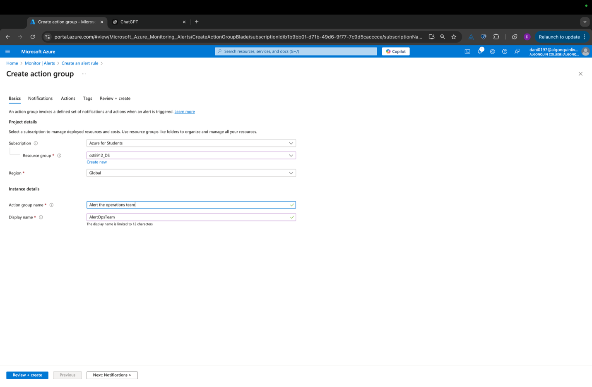


---

### Task 3: Configure action group notifications
1. In this task, if the alert is triggered send an email notification to the operations team.
2. Continue working on your alert. Select Next: Actions, and then select Create action group.
3. On the Basics tab, enter the following values for each setting:
   - Project details	
   - Subscription	your subscription
   - Resource group	CST8912
   - Region	Global (default)
   - Instance details	
   - Action group name	Alert the operations team (must be unique in the resource group)
   - Display name	AlertOpsTeam

 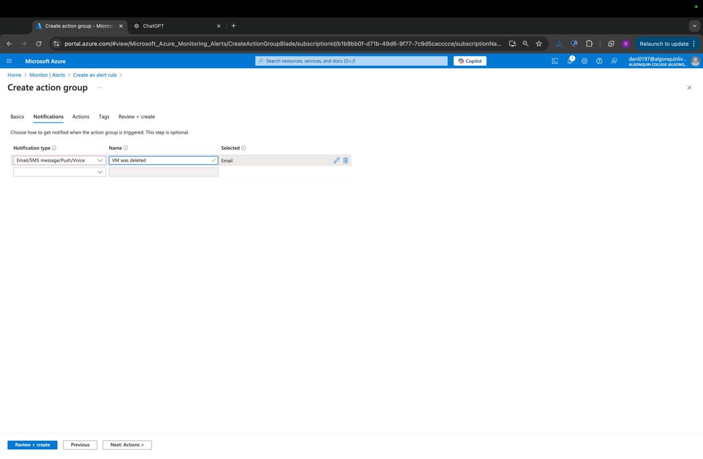

4. Select Next: Notifications and enter the following values for each setting:
   - Setting	Value
   - Notification type	Select Email/SMS message/Push/Voice
   - Name	VM was deleted
5. Select Email, and in the Email box, enter your email address, and then select OK.
6. Once the action group is created move to the Next: Details tab and enter the following values for each setting:
   - Setting	Value
   - Alert rule name	VM was deleted
   - Alert rule description	A VM in your resource group was deleted

 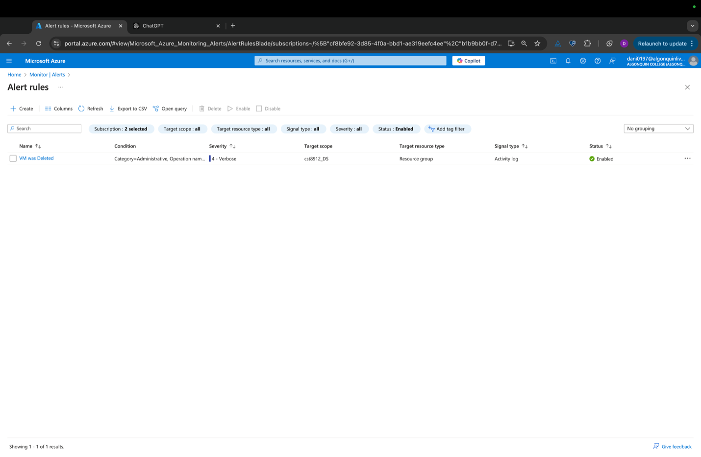

7. Select Review + create to validate your input, then select Create.

 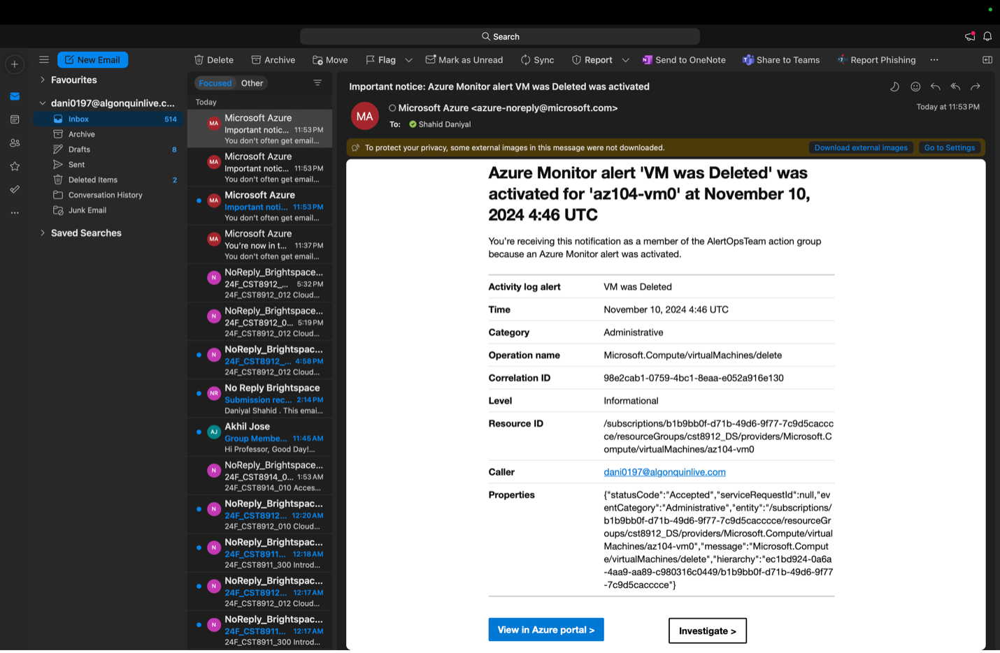


---

### Task 4: Trigger an alert and confirm it is working
1. In this task, you trigger the alert and confirm a notification is sent.
2. Note: If you delete the virtual machine before the alert rule deploys, the alert rule might not be triggered.
3. In the portal, search for and select Virtual machines.
4. Check the box for the az104-vm0 virtual machine.
5. Select Delete from the menu bar.
6. Check the box for Apply force delete. Enter delete to confirm and then select Delete.
7. In the title bar, select the Notifications icon and wait until vm0 is successfully deleted.
8. You should receive a notification email that reads, Important notice: Azure Monitor alert VM was deleted was activated... If not, open your email program and look for an email from azure-noreply@microsoft.com.
9. Screenshot of alert email.

 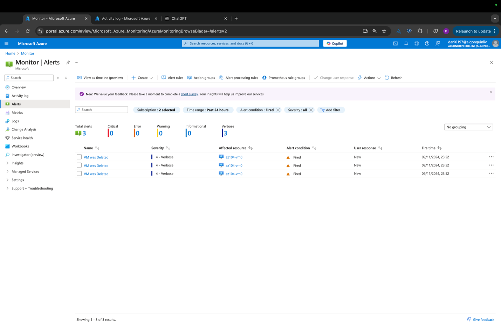

10. On the Azure portal resource menu, select Monitor, and then select Alerts in the menu on the left.
11. You should have verbose alerts that were generated by deleting vm0.

12. Note: It can take a few minutes for the alert email to be sent and for the alerts to be updated in the portal. If you don't want to wait, continue to the next task and then return.
13. Select the name of one of the alerts (For example, VM was deleted). An Alert details pane appears that shows more details about the event.

 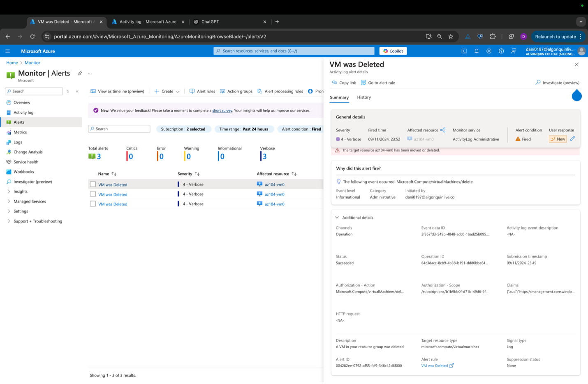


---

### Task 5: Configure an alert processing rule
1. In this task, you create an alert rule to suppress notifications during a maintenance period.
2. Continue in the Alerts blade, select Alert processing rules and then + Create.
3. Select your resource group, then select Apply.
4. Select Next: Rule settings, then select Suppress notifications.
5. Select Next: Scheduling.
6. By default, the rule works all the time, unless you disable it or configure a schedule. You are going to define a rule to suppress notifications during overnight maintenance. Enter these settings for the scheduling of the alert processing rule:
   - Setting	Value
   - Apply the rule	At a specific time
   - Start	Enter today's date at 10 pm.
   - End	Enter tomorrow's date at 7 am.
   - Time zone	Select the local timezone.
   - Screenshot of the scheduling section of an alert processing rule

 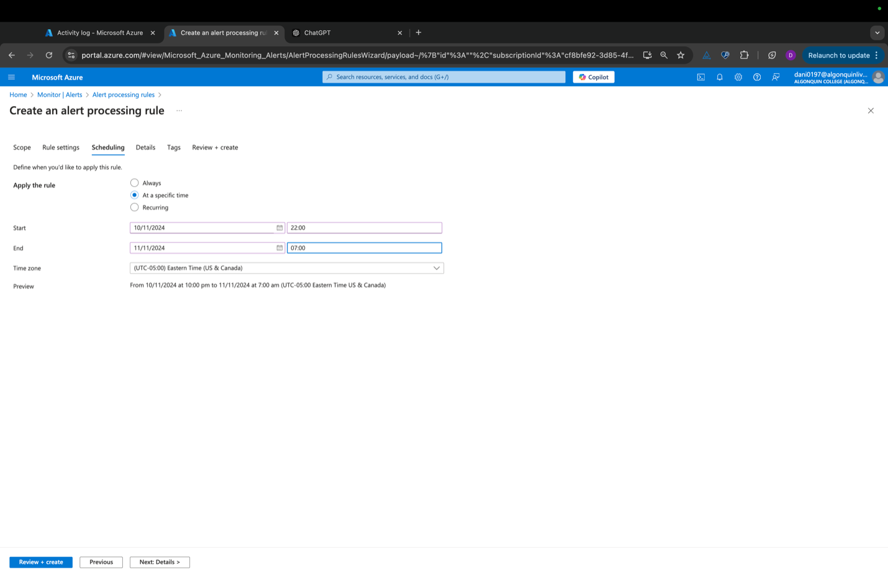

7. Select Next: Details and enter these settings:
   - Setting	Value
   - Resource group	CST8912
   - Rule name	Planned Maintenance
   - Description	Suppress notifications during planned maintenance.

 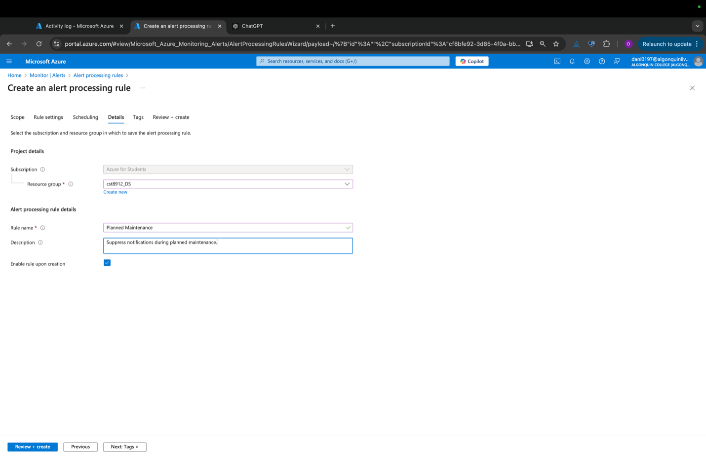

 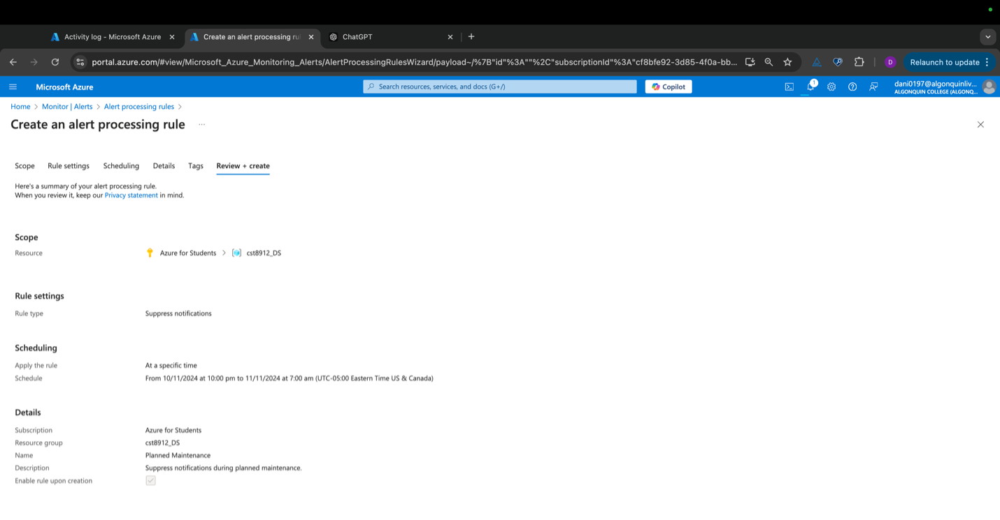


8. Select Review + create to validate your input, then select Create.

 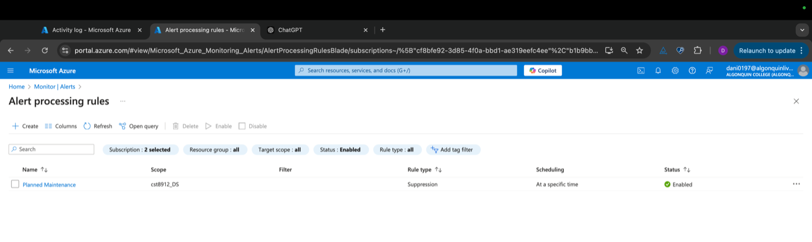


---

### Task 6: Use Azure Monitor log queries
1. In this task, you will use Azure Monitor to query the data captured from the virtual machine.
2. In the Azure portal, search for and select Monitor blade, click Logs.
3. If necessary close the splash screen.
4. Select a scope, your resource group. Select Apply.
5. In the Queries tab, select Virtual machines (left pane).
6. Review the queries that are available. Run (hover over the query) the Count heartbeats query.

 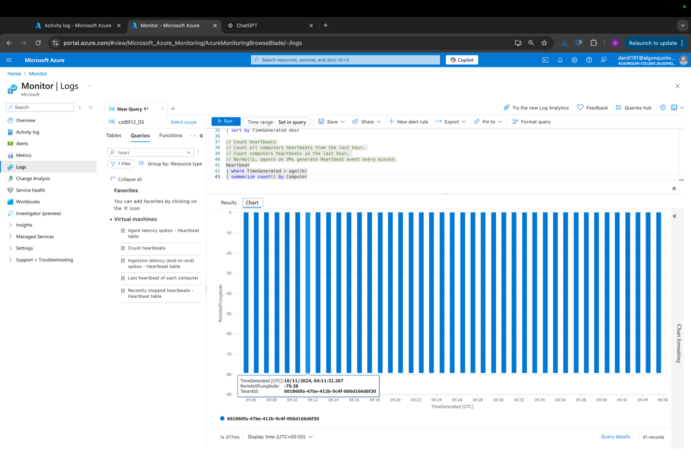

7. You should receive a heartbeat count for when the virtual machine was running.
8. Review the query. This query uses the heartbeat table.
9. Replace the query with this one, and then click Run. Review the resulting chart.

   ```plaintext
   InsightsMetrics
   | where TimeGenerated > ago(1d)
   | where Origin == "vm.azm.ms"
   | where Namespace == "Heartbeat"
   | summarize count() by bin(TimeGenerated, 1h)
   | render timechart

 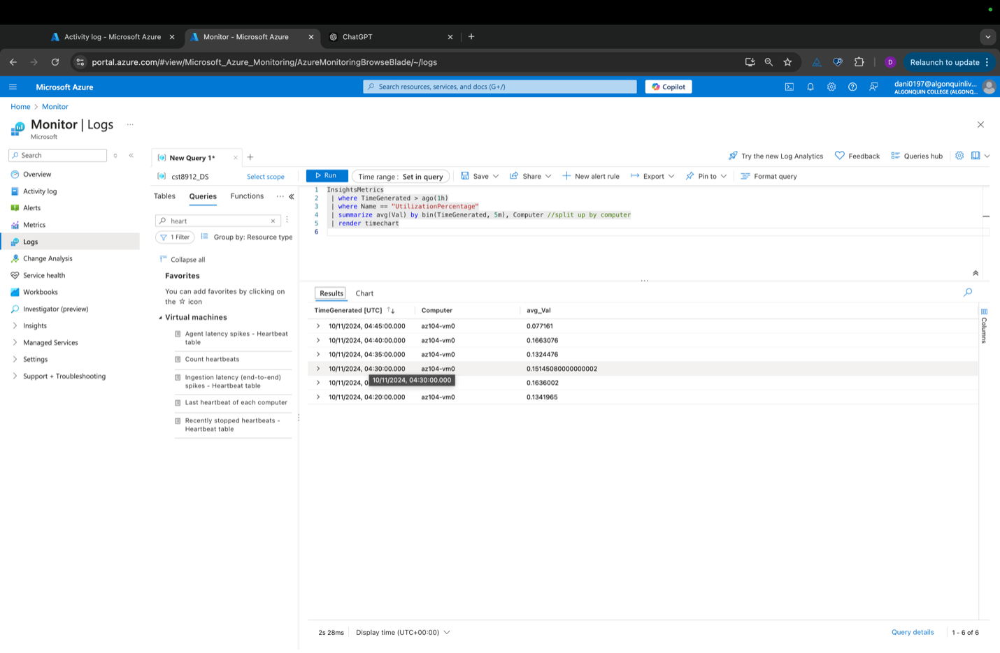

 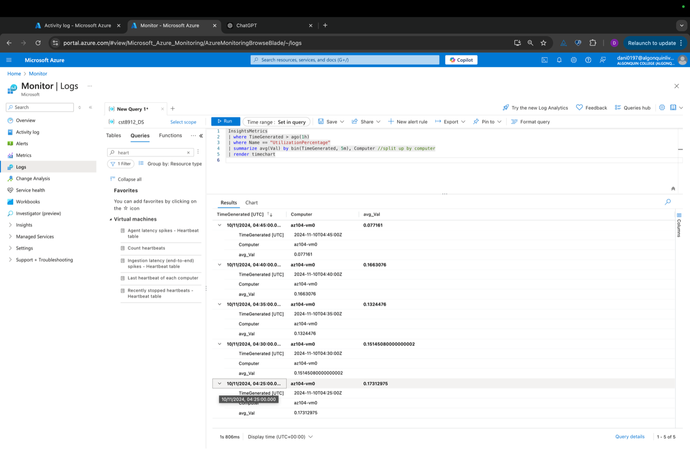

 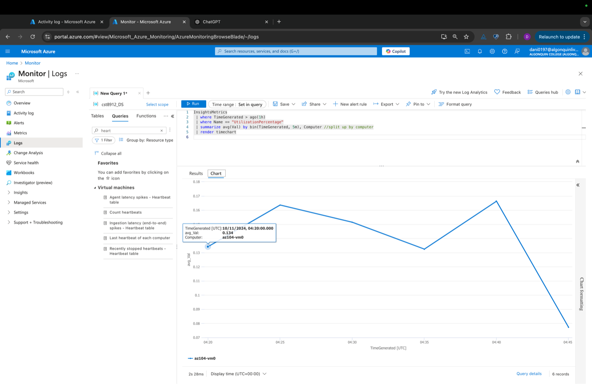


18.	As you have time, review and run other queries.
19.	Clean up the resources and document all the steps in the lab report

 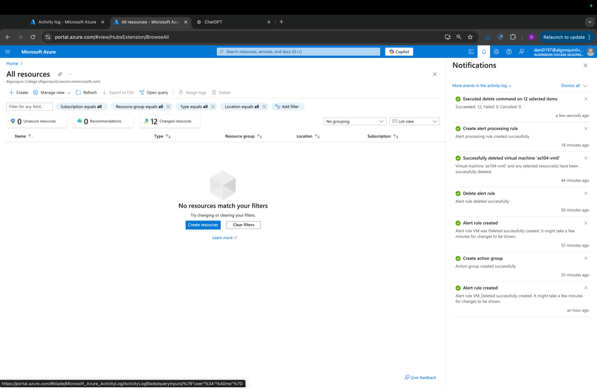

 

Conclusion of Lab 6: Cost Management and Monitoring in Azure
In this lab, we explored how Azure Monitor and Log Analytics can provide essential tools for cloud cost management and infrastructure monitoring, helping administrators keep resources in check and prevent unexpected expenses. By configuring alerts, setting up real-time notifications, and running log queries, we gained valuable insights into the workings of virtual machines and resource utilization patterns. The lab emphasized the importance of being proactive with alerts, such as when a VM is accidentally deleted, allowing for immediate response to avoid costly disruptions. Additionally, creating alert processing rules helped reduce alert fatigue during planned maintenance, focusing attention on critical events only. With log-based tracking and insights into resource performance, this lab demonstrated the full range of tools that Azure provides to help businesses gain a clear picture of their cloud costs, optimize infrastructure use, and respond quickly to potential issues.

Real Word Use Case

In a real-world business setting, these tools provide significant value by enhancing operational efficiency, cost control, and security. Real-time alerts and notifications enable administrators to quickly detect and address infrastructure issues, such as unexpected VM deletions or resource spikes, which helps keep operations running smoothly and minimizes unplanned downtime. Additionally, Azure’s monitoring and cost-management tools allow companies to track cloud spending closely. This visibility enables teams to make informed adjustments to resource usage, optimizing performance and reducing wasteful expenses. Furthermore, continuous monitoring and alerting for unusual activities strengthen security and support compliance efforts. These alerts help teams swiftly respond to any irregularities, protecting sensitive data and minimizing the risk of compliance violations. Another significant application of these monitoring tools is improving strategic planning and budgeting. With detailed insights into cloud expenses and resource utilization, businesses can forecast their cloud spending more accurately and develop strategies for cost optimization Azure Monitor’s data on resource usage patterns allows teams to identify high-cost areas and potential inefficiencies, which can then be addressed through scaling adjustments or resource reallocation. This insight aids financial planning and allows companies to allocate their budgets effectively, ensuring they stay within financial goals while maintaining optimal performance.

