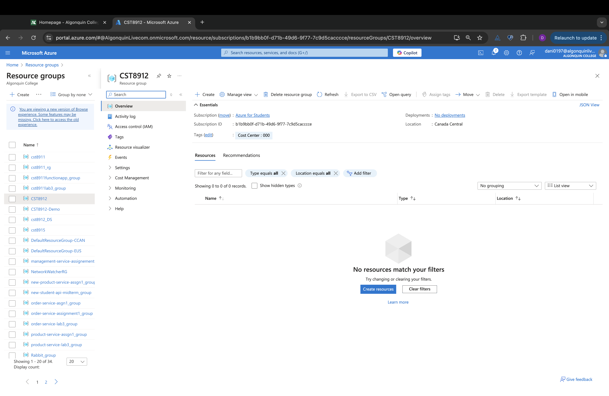
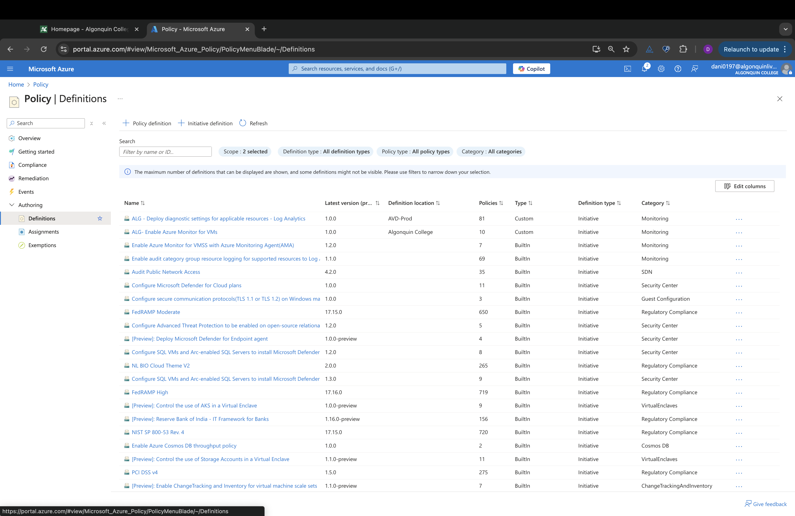
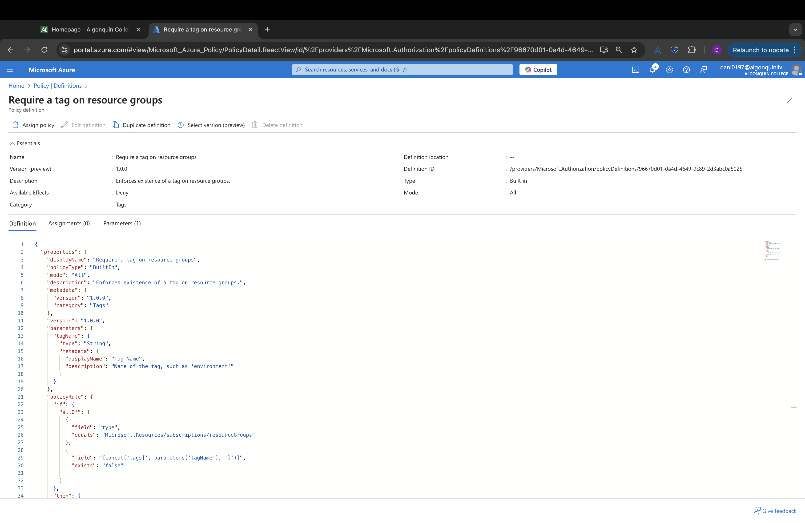
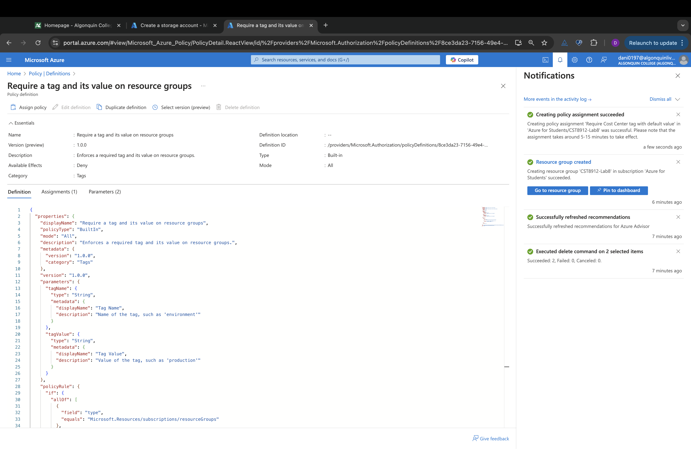
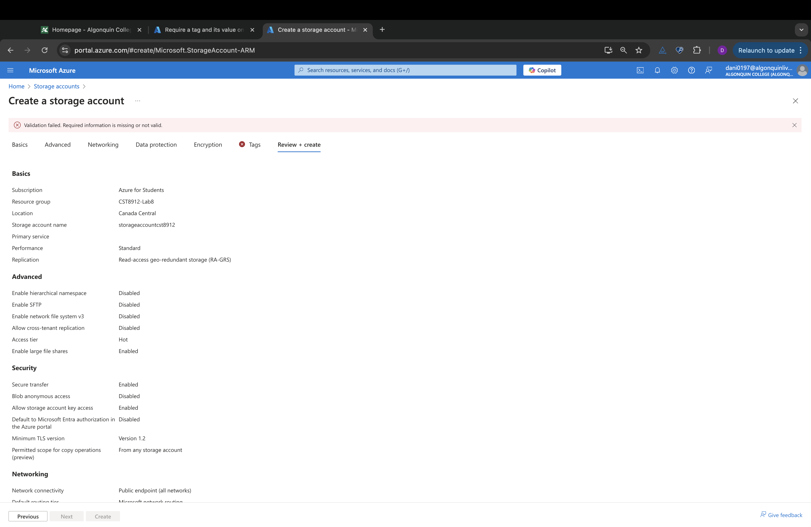

# CST8912 – Cloud Solution Architecture

## Cloud Development and Operations  
CST8912_013 Cloud Solution Architecture  
Lab 8_Week 11  

**Prepared By:** Daniyal Shahid (041110791)  
**Submitted to:** Prof. Ragini Madan  

---

## Graded Lab Activity #8

1. **Task 1**: Create and assign tags via the Azure portal
2. **Task 2**: Enforce tagging via an Azure policy
3. **Task 3**: Apply tagging via an Azure policy
4. **Task 4**: Configure and test resource locks
5. **Task 5**: Clean up the resources

---

### Task 1: Assign tags via the Azure portal

1. Sign in to the Azure portal - [https://portal.azure.com](https://portal.azure.com).
2. Search for and select **Resource groups**.

    | Setting            | Value             |
    |--------------------|-------------------|
    | Subscription name  | your subscription |
    | Resource group name | CST8912          |
    | Location           | Canada Central    |

3. From **Resource groups**, select **+ Create**.
4. **Note**: Proceed to **Next: Tags** and create a new tag.

    | Setting | Value |
    |---------|-------|
    | Name    | Cost Center |
    | Value   | 000         |

5. Select **Review + Create**, then select **Create**.

---

### Task 2: Enforce tagging via an Azure policy

1. In the Azure portal, search for and select **Policy**.
2. In the **Authoring** blade, select **Definitions**. Browse through the list of built-in policy definitions.
3. Search for “require a tag” and select **Require a tag and its value on resources**.

4. Click **Assign** on the **Require a tag and its value on resources** policy definition.

    | Setting           | Value             |
    |-------------------|-------------------|
    | Subscription      | your subscription |
    | Resource Group    | CST8912           |
    | Assignment name   | Require Cost Center tag with Default value |
    | Description       | Require Cost Center tag with default value for all resources in the resource group |
    | Policy enforcement | Enabled           |

5. Set **Parameters** as follows:

    | Setting | Value |
    |---------|-------|
    | Tag Name | Cost Center |
    | Tag Value | 000        |

6. Leave the **Create a Managed Identity** checkbox unchecked, then click **Review + Create** and **Create**.

7. **Verification**: Attempt to create an Azure Storage account in the resource group without the required tag. You should receive a **Validation failed** message, indicating the policy is in effect.

---

### Task 3: Apply tagging via an Azure policy

1. Use the policy definition to remediate non-compliant resources by inheriting the Cost Center tag.

2. In **Policy > Assignments**, delete the **Require Cost Center tag with Default value** policy assignment.

3. **Assign policy** and specify:

    | Setting           | Value             |
    |-------------------|-------------------|
    | Subscription      | your Azure subscription |
    | Resource Group    | CST8912           |
    | Assignment name   | Inherit the Cost Center tag and its value 000 from the resource group if missing |
    | Description       | Inherit the Cost Center tag and its value 000 from the resource group if missing |
    | Policy enforcement | Enabled           |

4. Set **Parameters** as follows:

    | Setting | Value |
    |---------|-------|
    | Tag Name | Cost Center |

5. **Remediation Settings**:

    | Setting               | Value               |
    |-----------------------|---------------------|
    | Create a remediation task | enabled          |
    | Policy to remediate   | Inherit a tag from the resource group if missing |

6. **Verification**: Create a new storage account in the resource group without adding the required tag. Confirm that the Cost Center tag with the value 000 is automatically assigned.

---

### Task 4: Configure and test resource locks

1. Search for and select your resource group.
2. In the **Settings** blade, select **Locks** and add a lock with the following settings:

    | Setting   | Value   |
    |-----------|---------|
    | Lock name | rg-lock |
    | Lock type | delete  |

3. Attempt to delete the resource group. You should receive a notification denying the deletion due to the lock.

---

### Task 5: Clean up the resources

1. In **Policy > Assignments**, delete the policy assignment created in Task 3.
2. In **Storage accounts**, select the resource group associated with the storage account, delete the **Infra** tag, and delete the storage account after confirming the name.

---

## Conclusion

This lab focused on organizing and securing Azure resources using tags, enforced tagging policies, and resource locks. By tagging and setting policies, we ensured all resources align with company standards, making cloud management efficient and secure.

### Business Use Case

For a large company, tagging and policy enforcement make it easy to track cloud spending by department, while resource locks prevent accidental deletions of critical assets. This approach boosts organization, cost control, and security across cloud projects.

